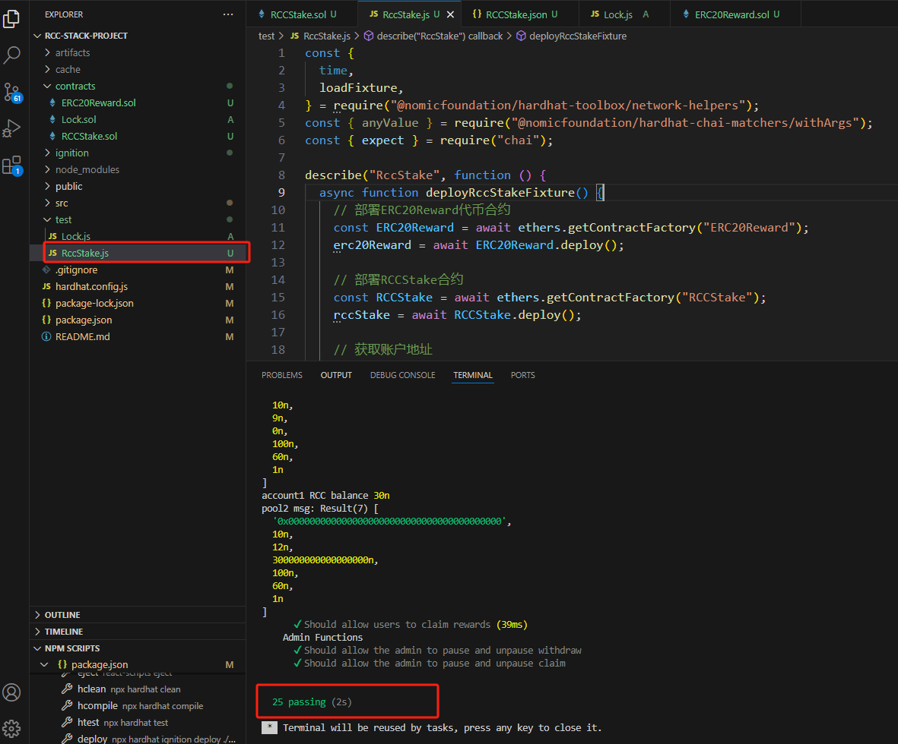
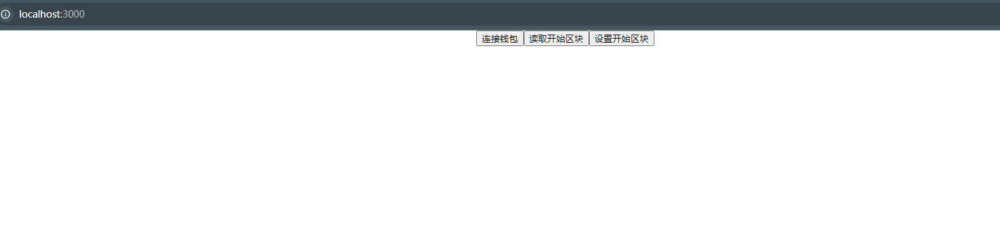
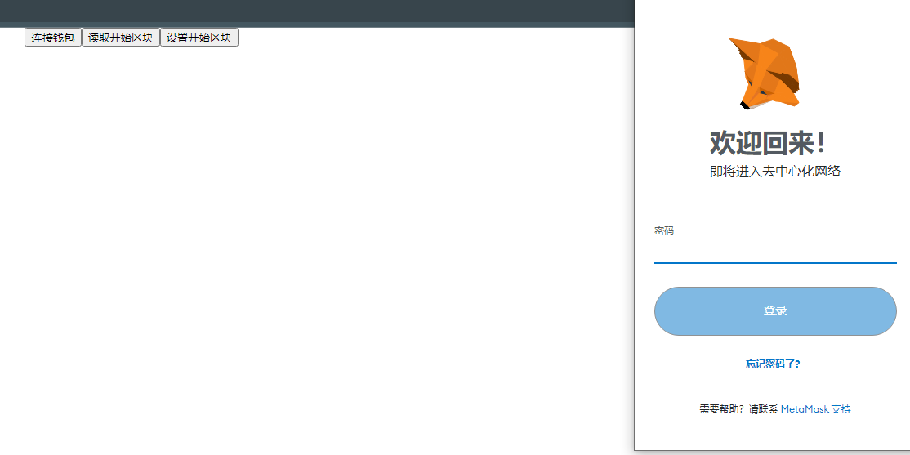
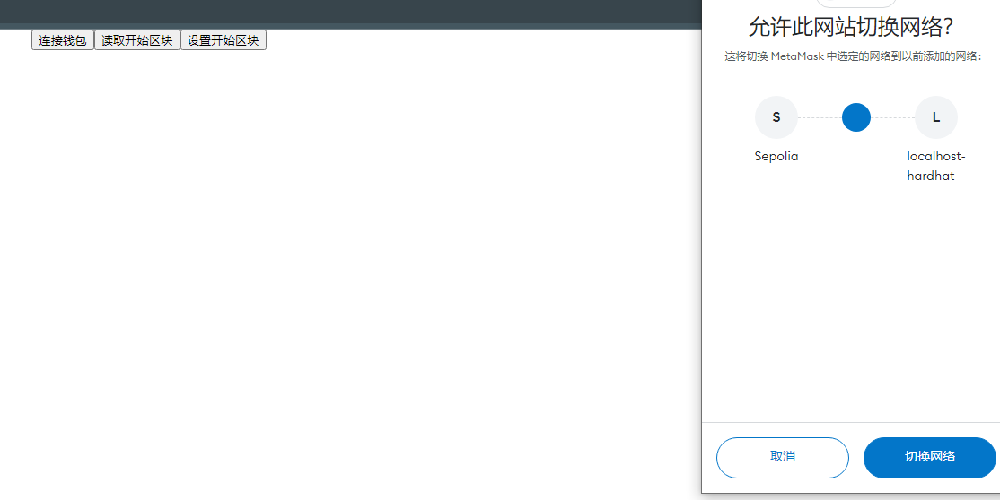
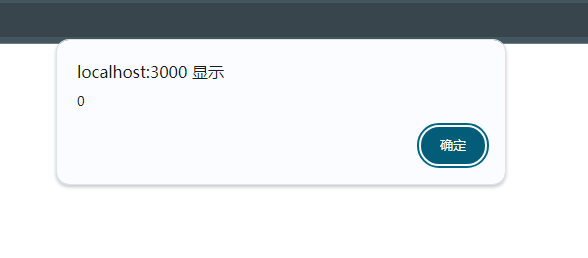
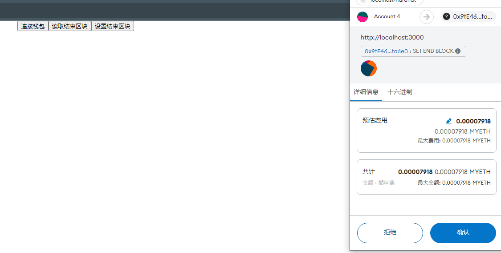
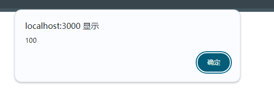

## 1 : 合约测试
基本实现RCCStake主要功能点的覆盖测试

## 2  前端简单实现MetaMask连接 

由于speolia测试网络上的余额不够交易，连接MetaMask主动询问切换本地hardhat网络

## 3 测试合约读取操作

读取RCCStake合约的结束区块，默认是0

## 4 测试合约写入操作
代码默认写入100

写入成功：

  

## 5 后续优化
1.除了原生货币pool,同时新开stake token是erc20Token的pool

2.学习点前端，完善下交互页面，实现从质押到解除质押，提取奖励的全流程页面交互
